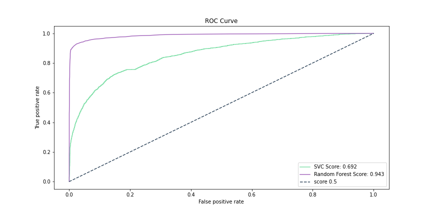

# 🏦 Bank Churn Analysis: Project Overview  
* End to end project reasearching the effects attributes have on the churn of a bank customer and predicting those customers that may churn.
* Optimized Logistic Regression, KNN, SVC, Decision Tree, and Random Forest Regressors using GridsearchCV to reach the best model. 
* Built a stakeholder facing visual deployment of model to predict churn of new customers 
* Deployed Model in Power BI for Business Intelligence analysis 


[View Deployed Model in Power BI](https://app.powerbi.com/view?r=eyJrIjoiNDExYjQ0OTUtNWI5MC00OTQ5LWFlYmUtYjNkMzE1YzE2NmE0IiwidCI6IjYyZWE3MDM0LWI2ZGUtNDllZS1iZTE1LWNhZThlOWFiYzdjNiJ9&pageName=ReportSection)
         
## Resources Used
**Python 3, SQL Server, Power BI** 

[**Anaconda Packages:**](requirements.txt) **pandas, numpy, pandas_profiling, ipywidgets, sklearn, matplotlib, seaborn, sqlalchemy, pyodbc, kaggle, pickle, lxml**   

## [Data Collection](Code/P2_Code.ipynb)
Data loaded using kaggle API <br>
```
!kaggle datasets download -d kmalit/bank-customer-churn-prediction -p ..\Data --unzip 
```
[Data source link](https://www.kaggle.com/kmalit/bank-customer-churn-prediction)
[Data](Data/Churn_Modelling.csv)
*  Rows: 10000 | Columns: 14
    *   RowNumber
    *   CustomerId  
    *   Surname 
    *   CreditScore
    *   Geography
    *   Gender
    *   Age
    *   Tenure
    *   Balance
    *   NumOfProducts
    *   HasCrCard
    *   IsActiveMember
    *   EstimatedSalary
    *   Exited


## [Data Pre-processing](Code/P2_Code.ipynb)
After I had all the data I needed, I needed to check it was ready for exploration and later modelling. I made the following changes and created the following variables:   
*   General NULL and data validity checks  


## [Data Warehousing](Code/P2_Code.ipynb)
I warehouse all data in a SQL Server instance for later use and reference.

*   ETL in python to SQL Server Database.
*   Formatted column headers to SQL compatibility.  

## [Exploratory data analysis](Code/P2_Code.ipynb) 
I looked at the distributions of the data and the value counts for the various categorical variables that would be fed into the model. Below are a few highlights from the analysis.
*   79.63% of customers have churned - Distrubution of features and their effects on churning - Some features have outliers, visualising this allows for greater clarifty on the extent. 


*   I looked at the correlation the features have


## [Data Visualisation & Analytics](https://app.powerbi.com/view?r=eyJrIjoiNDExYjQ0OTUtNWI5MC00OTQ5LWFlYmUtYjNkMzE1YzE2NmE0IiwidCI6IjYyZWE3MDM0LWI2ZGUtNDllZS1iZTE1LWNhZThlOWFiYzdjNiJ9&pageName=ReportSection)
[View Interactive Dashboard](https://app.powerbi.com/view?r=eyJrIjoiNDExYjQ0OTUtNWI5MC00OTQ5LWFlYmUtYjNkMzE1YzE2NmE0IiwidCI6IjYyZWE3MDM0LWI2ZGUtNDllZS1iZTE1LWNhZThlOWFiYzdjNiJ9&pageName=ReportSection)
*   I created an interactive dashboard to deploy the machine learning model to benefit the business.
*   I visualised various key features and hihglighted their overall correlation to a customers churn. 

## Business Intelligence
On Page 2 of the interactive dashboard I have provided the stake holders with the new customer names and the customers that are likely to churn due to their characteristics.

*   These customers can be offered subsidised deals and incentives to keep them on
*   Greater engagement with customers could keep some customers on board 
*   Providing quality customer service can also provide customers with long term value and appreciation for the business
*   The complaints team should pay particular attention to complaints from customers who are predicted to churn.
- 96% of unhappy customers dont complain  and 91% of those will simply leave and never come back?

## [Feature Engineering](Code/P2_Code.ipynb)   
I transformed the categorical variable(s) 'geography' and 'gender' into dummy variables. I also split the data into train and tests sets with a test size of 20%.
*   One Hot encoding to encode values
*   Using RobustScaler to scale  

## [ML/DL Model Building](Code/P2_Code.ipynb)

I tried five different models and evaluated them using initially using accuracy_score and then MSE/RMSE. I chose MSE and RMSE because it is sensitive to outliers, punishes larger errors and is relatively easy to interpret.   

I tried five different models:
*   **Logistic Regression**
*   **KN Neighbors Classifier** 
*   **Support Vector Classifier** 
*   **Decision Tree Classifier** 
*   **Random Forest Classifier**


## [Model performance](Code/P2_Code.ipynb)
The Random Forest Classifier model outperformed the other approaches on the test and validation sets. 
*   **Random Forest Classifier** : Accuracy = 86.8% 

## [Model Optimisation and Evaluation](Code/P2_Code.ipynb)
In this step, I used GridsearchCV to find the best parameters to optimise the performance of the model.
However in this instance the performance of the model was reduced, so I stuck with the intial paramaters. 

*   **Random Forest Classifier** : Accuracy = 86.8% | MSE = 0.1295 | RMSE = 0.36 (2dp)

## [Deployment](https://app.powerbi.com/view?r=eyJrIjoiNDExYjQ0OTUtNWI5MC00OTQ5LWFlYmUtYjNkMzE1YzE2NmE0IiwidCI6IjYyZWE3MDM0LWI2ZGUtNDllZS1iZTE1LWNhZThlOWFiYzdjNiJ9&pageName=ReportSection)
I deployed this model in Microsoft Power BI for business intellignece use. [View visualisation code prep](Code/P2_Vis_prep.ipynb)
*   I exported the model as a .pkl file and applied it to the unseen data set to get churn predictions and probability predictions.
*   I visualised this in Power BI and using conditional formatting to highlight those new customer sthat are more likely to curn based on the models prediction. 


## [Model Evaluation](Code/P2_Code.ipynb)
*   A confusion matrix showing the accuracy score of 86.8% achieved by the model. 
**Random Forest Classifier**


*   Plotted a ROC curve to show the trade-off between sensitivity (or TPR) and specificity (1 – FPR). Classifiers that give curves closer to the top-left corner indicate a better performance. Here we see how the Random Forest Classifier outperforms the SVC.


*   Using 'feature_importances_' I found the age of a customer has the biggest weight in how likely they are to churn. 


## Project Evaluation
*   WWW
    *   The end-to-end process
    *   Deployment and sharing of work 
    *   Communicating business intelligence analysis from data science work
*   EBI 
    *   Better project management and planning would have made this project faster


## [Project Management (Agile | Scrum)](https://www.atlassian.com/software/jira)
* Resources used
    * Jira
    * Confluence
    * Trello 

## Questions and See more projects    

* ### [See more projects here](https://github.com/MattithyahuData?tab=repositories)
* ### [Contact me here](mailto:theanalyticsolutions@gmail.com) 


